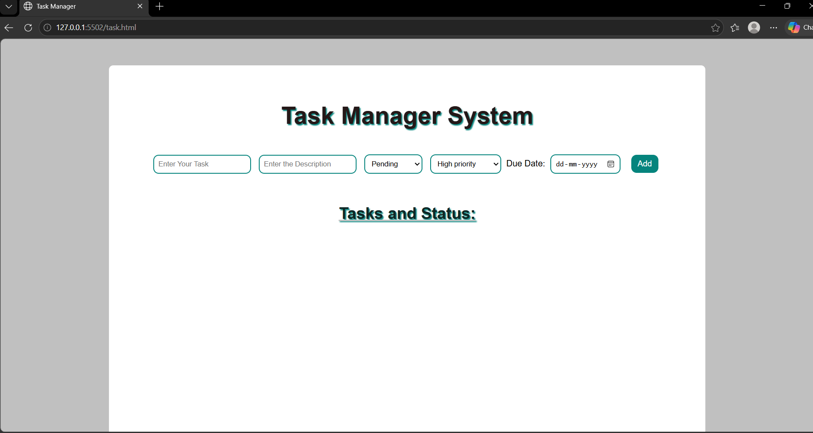
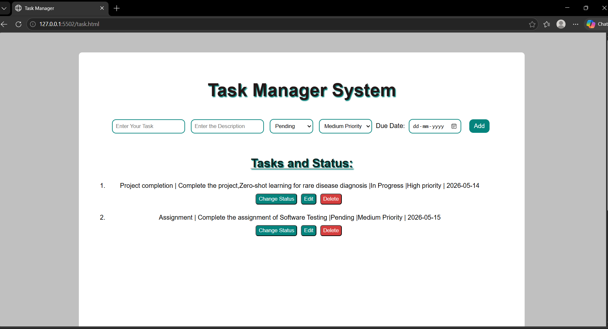
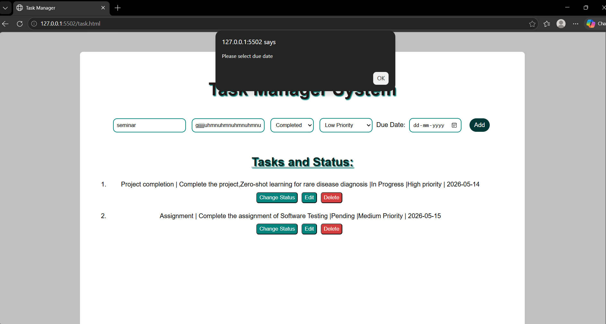
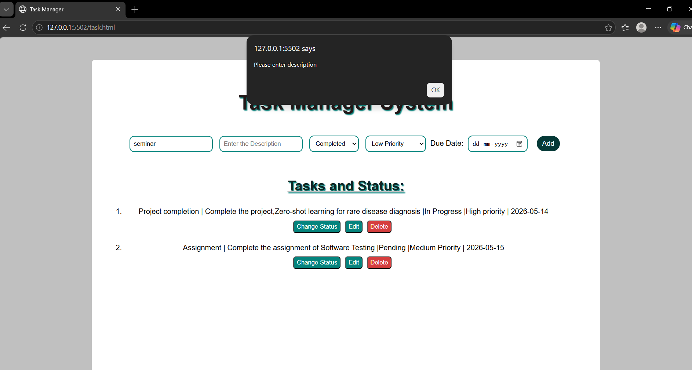

## Task Manager Web Application

A simple Task Manager web application developed using HTML, CSS, and JavaScript.

## Features
- Add new tasks
- Mark tasks as completed
- Delete tasks
- Responsive user interface
- Task management using JavaScript
- Stores tasks dynamically during usage

## Technologies Used
- HTML
- CSS
- JavaScript

## Project Structure
```text
task.html   -> Main HTML file
task.css    -> Styling file
task.js     -> JavaScript functionality
```

## How to Run
1. Download or clone the repository
2. Open `task.html` in your browser

## Screenshots:

### Home Page


### Task Added Successfully


### Validation Message


### Additional Validation


## Author
Irfana Sherin


